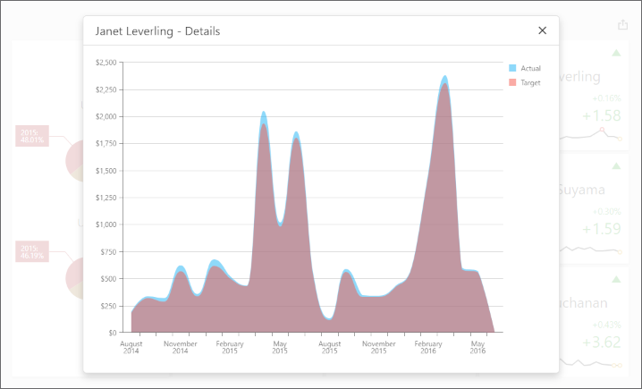

<!-- default badges list -->

<!-- default badges end -->
# Dashboard for MVC - How to obtain a dashboard item's client data

The following example uses the DashboardControl's [client-side API](https://docs.devexpress.com/Dashboard/16796) to obtain client data that corresponds to a particular visual element. When you click a card, the [`dxChart`](https://js.devexpress.com/DevExtreme/ApiReference/UI_Components/dxChart/) displays the detailed chart and shows a variation of actual/target values over time.

The [`ViewerApiExtensionOptions.onItemClick`](https://docs.devexpress.com/Dashboard/js-DevExpress.Dashboard.ViewerApiExtensionOptions#js_devexpress_dashboard_viewerapiextensionoptions_onitemclick) event is handled to obtain client data and invoke the [`dxPopup`](https://js.devexpress.com/DevExtreme/ApiReference/UI_Components/dxPopup/) component with the `dxChart`.

In the event handler, the [`e.getData`](https://docs.devexpress.com/Dashboard/js-DevExpress.Dashboard.ItemClickEventArgs#js_devexpress_dashboard_itemclickeventargs_getdata) method call obtains dashboard item's client data. The [`e.getAxisPoint`](https://docs.devexpress.com/Dashboard/js-DevExpress.Dashboard.ItemClickEventArgs#js_devexpress_dashboard_itemclickeventargs_getaxispoint) method returns the axis point corresponding to the clicked card while the [`ItemData.getSlice`](https://docs.devexpress.com/Dashboard/js-DevExpress.Dashboard.Data.ItemData?p=netframework#js_devexpress_dashboard_data_itemdata_getslice_value_) method returns the slice of client data by this axis point.

The [`ItemDataAxis.getPoints`](https://docs.devexpress.com/Dashboard/js-DevExpress.Dashboard.Data.ItemDataAxis?p=netframework#js_devexpress_dashboard_data_itemdataaxis_getpoints) method is used to obtain axis points that belongs to the "Sparkline" data axis. Corresponding actual/target values are obtained using the [`ItemData.getDeltaValue`](https://docs.devexpress.com/Dashboard/js-DevExpress.Dashboard.Data.ItemData?p=netframework#js_devexpress_dashboard_data_itemdata_getdeltavalue_deltaid_) method.

## Files to Look At

- [Index.cshtml](./CS/MvcDashboardApp_ClientData/Views/Home/Index.cshtml)
- [ClientData.js](./CS/MvcDashboardApp_ClientData/Scripts/ClientData.js)

## Documentation

- [Client-Side API Overview for ASP.NET MVC Dashboard ](https://docs.devexpress.com/Dashboard/16796/web-dashboard/aspnet-mvc-dashboard-extension/client-side-api-overview)

## More Examples

- [Dashboard for Web Forms - How to get data from a clicked dashboard item](https://github.com/DevExpress-Examples/Web-Dashboard---How-to-get-data-from-a-clicked-dashboard-item)
- [Dashboard for Web Forms - How to obtain a dashboard item's underlying data for a clicked visual element](https://github.com/DevExpress-Examples/aspxdashboard-how-to-obtain-a-dashboard-items-underlying-data-for-a-clicked-visual-element-t492257)
- [Dashboard for Web Forms - How to obtain underlying data for the specified dashboard item](https://github.com/DevExpress-Examples/aspxdashboard-how-to-obtain-underlying-data-for-the-specified-dashboard-item-t518504)
- [Dashboard for ASP.NET Core - How to obtain a dashboard item's client data](https://github.com/DevExpress-Examples/asp-net-core-dashboard-get-client-data)
- [Dashboard for ASP.NET Core  - How to obtain a dashboard item's underlying data for a clicked visual element](https://github.com/DevExpress-Examples/asp-net-core-dashboard-get-underlying-data-for-clicked-item)
- [Dashboard for ASP.NET Core  - How to obtain underlying data for the specified dashboard item](https://github.com/DevExpress-Examples/asp-net-core-dashboard-display-item-underlying-data)
